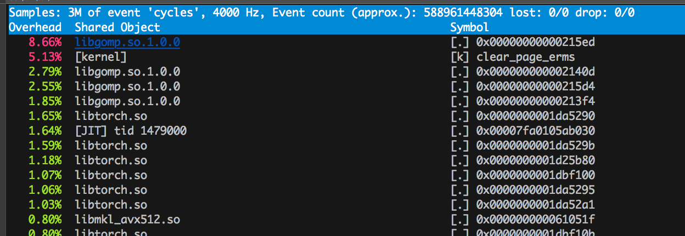

## profiling deep learning frameworks.

Examples on how to profile deep learning workloads with Linux tools.

### Pytorch

Pull a docker image with Pytorch

- Stacks Pytorch image

```bash
docker pull sysstacks/dlrs-pytorch-clearlinux
```

#### Run benchmark inside the container

Instantiate the stacks image, and mount the current directory to the image.

```bash
docker run -v`pwd`:/workspace/bmark/ -it sysstacks/dlrs-pytorch-clearlinux
```

Run the code to benchmark  with the tuner, that sets threading paramaters and attempts different values.

```bash
cd /workspace/bmark/scripts
./tune_shim.sh ../benchmark/cnn_benchmarks.py1
```

Output example

```bash
-------------------------------  ---------------  ---------------  ---------------  ---------------  --------------- 
Name                             Self CPU total %  Self CPU total   CPU total %      CPU total        CPU time avg   
-------------------------------  ---------------  ---------------  ---------------  ---------------  --------------- 
uniform_                         16.09%           176.567ms        16.09%           176.567ms        176.567ms       
uniform_                         6.44%            70.649ms         6.44%            70.649ms         70.649ms        
MkldnnConvolutionBackward        6.14%            67.374ms         6.14%            67.374ms         67.374ms        
MkldnnConvolutionBackward        5.99%            65.736ms         5.99%            65.736ms         65.736ms        
mkldnn_convolution_backward      5.99%            65.718ms         5.99%            65.718ms         65.718ms        
MkldnnConvolutionBackward        5.98%            65.589ms         5.98%            65.589ms         65.589ms        
mkldnn_convolution_backward      5.97%            65.571ms         5.97%            65.571ms         65.571ms        
MkldnnConvolutionBackward        5.93%            65.135ms         5.93%            65.135ms         65.135ms        
mkldnn_convolution_backward      5.93%            65.118ms         5.93%            65.118ms         65.118ms        
MkldnnConvolutionBackward        5.93%            65.083ms         5.93%            65.083ms         65.083ms        
MkldnnConvolutionBackward        5.93%            65.068ms         5.93%            65.068ms         65.068ms        
mkldnn_convolution_backward      5.93%            65.067ms         5.93%            65.067ms         65.067ms        
mkldnn_convolution_backward      5.93%            65.050ms         5.93%            65.050ms         65.050ms        
MkldnnConvolutionBackward        5.92%            64.977ms         5.92%            64.977ms         64.977ms        
mkldnn_convolution_backward      5.92%            64.957ms         5.92%            64.957ms         64.957ms        
-------------------------------  ---------------  ---------------  ---------------  ---------------  --------------- 
Self CPU time total: 1.098s
CUDA time total: 0.000us
```

## Perf

Using perf profiler, let's see the top processes while running the benchmark

```bash
perf top
```



